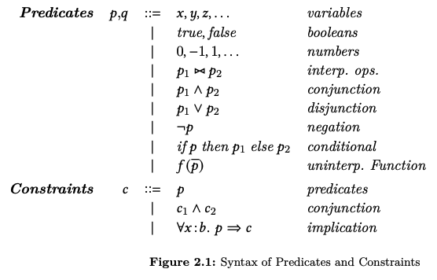
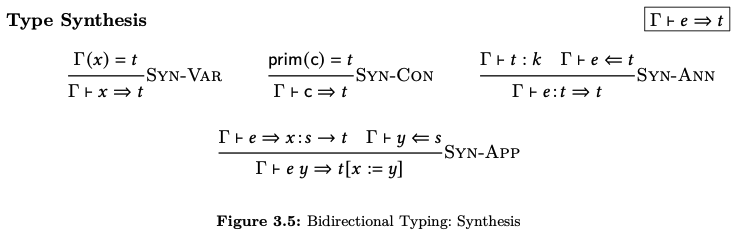

# Tutorial: Building a Refinement Type Checker

In this tutorial, we'll implement a type checker for a small (but still interesting) refinement type system in Formulog.
In particular, we'll implement the declarative, bidirectional type checking rules for the first system in the article [Refinement Types: A Tutorial](https://arxiv.org/abs/2010.07763) by Ranjit Jhala and Niki Vazou [1].
Our hope is that our tutorial gives a good overview of many Formulog features, and a flavor of what it is like to program a nontrivial analysis in Formulog.

### Intended audience

This tutorial is intended for the PL practitioner (e.g., a grad student, academic, or research engineer).
We assume you are familiar with SMT solving, ML-like functional languages, and logic programming, and also have some level of comfort with formal programming language notation (like inference rules).
It is also probably helpful to have read one of our Formulog publications, which should (hopefully) give a good sense for the overall design of the language and its motivations.
If you are not familiar with refinement type checking or bidirectional type systems, you should probably skim the first few sections of the tutorial by Jhala and Vazou [1] (we'll focus on Sections 3.1 and 3.2).

### Help Improve This Tutorial

We're eager for feedback on ways to make this tutorial clearer and more useful!
If you have a question about the content of this tutorial, a suggestion for improvement, or a bug report, please let us know by raising a [GitHub issue](https://github.com/HarvardPL/formulog/issues/new).

### Attribution

This tutorial includes figures from the article [Refinement Types: A Tutorial](https://arxiv.org/abs/2010.07763) (v1) by Ranjit Jhala and Niki Vazou [1], which has been published under a [CC BY 4.0 license](https://creativecommons.org/licenses/by/4.0/).
We will refer to this article as "JV" for short.

## General Approach

One of the advantages of writing a program analysis in Datalog is to be able to implement analysis logic at the level of mathematical specification.
Formulog extends this benefit to analyses where the formal specification involves constructing logical terms (i.e., SMT formulas) and determining their satisfiability/validity (i.e., SMT solving).
Our typical approach when implementing an analysis in Formulog is thus to try to directly translate the formal specification of an analysis---inference rules and mathematical helper functions---into Horn clauses and functional code.

This is the approach we will follow in this tutorial: directly translate the formalism of JV as we encounter it, and then go back to patch our implementation as necessary.
Concretely, we will work our way through JV Sections 3.1 and 3.2.
For the full, final code, see [tutorial.flg](tutorial.flg).

## Definitions

The first formalism we encounter in JV Section 3.1 is a definition of types and environments (Figure 3.1), which also refers to the definitions of predicates (Figure 2.1).




We can encode these BNF-style definitions (along with the definition of constraints) using Formulog's support for algebraic data types:

```
(* An algebraic data type with a single variant *)
type basic_typ =
    | b_int

(* A type alias *)
type var = string

(* Interpreted operations: for simplicity, we'll support just a few *)
type op =
    | o_add
    | o_eq

type pred =
    | p_var(var)
    | p_bool(bool)
    | p_int(i32) (* i32 is the type of a 32-bit signed integer *)
    | p_interp_op(op, pred, pred)
    | p_conj(pred, pred)
    | p_disj(pred, pred)
    | p_neg(pred)
    | p_ite(pred, pred, pred)

type constraint =
    | c_pred(pred)
    | c_conj(constraint, constraint)
    | c_imp(var, basic_type, pred, constraint)

type typ =
    | t_refined(basic_typ, var, pred)
    | t_func(var, typ, typ)

type kind =
    | k_base
    | k_star

(* Tuples and lists are built-ins *)
type env = (var * typ) list
```

We can then similarly encode expressions, following Figure 3.2.


```
type expr =
    | e_int(i32)
    | e_var(var)
    | e_let(var, expr, expr)
    | e_lambda(var, expr)
    | e_app(expr, var)
    | e_annot(expr, typ)
```

### Well-formedness

The first judgments---which define type well-formedness---are given in Figure 3.3.


Typically, in Formulog, you would encode inference rules like these using Horn clauses, so let's do that here.

First, we need to declare a relation for well-formedness:

```
rel wf(env, typ, kind)
```

We can then encode the rules one by one, with reference to this relation.
Let's start with the simplest rule, Wf-Kind:

```
wf(G, T, k_star) :- wf(G, T, k_base).
```

Horn clauses are read right to left, so this rule is saying that types that are well-formed at kind base are also well-formed at kind star.
Identifiers beginning with an uppercase letter are logic programming variables, which are implicitly universally quantified across the entire rule.

Wf-Fun is not too bad to encode either:

```
wf(G, t_func(X, S, T), k_star) :-
    wf(G, S, _Ks),
    wf((X, S) :: G, T, _Kt).
```

Two things to note:

- Identifiers that begin with an underscore are anonymous variables. Formulog will reject rules where a non-anonymous variable only appears once (a common bug).
- As in ML variants, the infix constructor `::` is the cons of a value and a list; in this case, we use it to extend the environment with a new binding (represented as a tuple).

Once we get to WF-Base, we notice that we're missing something: the premise requires the well-sortedness of a predicate, a judgment that is not defined by JV, although the authors say that this amounts to standard type checking (with refinements ignored).
We'll have to declare a relation for this and encode the rules:

```
rel pred_wf(env, pred, basic_typ)
```

First, we might try to encode that a boolean value is, well, a boolean; to do so, we need to revise our definition of basic types to also include booleans:

```
(* Revised definition *)
type basic_typ =
    | b_int
    | b_bool
```

We can then encode the rule for boolean literals:

```
pred_wf(_G, p_bool(_B), b_bool).
```

The rules for most the other constructs is straightforward:

```
pred_wf(_G, p_int(_I), b_int).

pred_wf(G, p_interp_op(o_add, P1, P2), b_int) :-
    pred_wf(G, P1, b_int),
    pred_wf(G, P2, b_int).

pred_wf(G, p_interp_op(o_eq, P1, P2), b_bool) :-
    pred_wf(G, P1, T),
    pred_wf(G, P2, T).

(* We can define a Horn clause with two heads, meaning both conclusions hold *)
pred_wf(G, p_conj(P1, P2), b_bool),
pred_wf(G, p_disj(P1, P2), b_bool) :-
    pred_wf(G, P1, b_bool),
    pred_wf(G, P2, b_bool).

pred_wf(G, p_neg(P), b_bool) :-
    pred_wf(G, P, b_bool).

pred_wf(G, p_ite(P1, P2, P3), T) :-
    pred_wf(G, P1, b_bool),
    pred_wf(G, P2, T),
    pred_wf(G, P3, T).
```

The leaves us just handling variables; to do so, we need to define what it means to look up a variable in an environment.
Formulog's first-order functional programming comes in handy for defining this type of helper function:

```
fun lookup(x: var, g: env): typ option =
    match g with
    | [] => none
    | (y, t) :: rest => if x = y then some(t) else lookup(x, rest)
    end
```

The `option` type (with its constructors `none` and `some`) is built into Formulog.
We can now define the judgment for variables, as well as our final judgment for type well-formedness.

```
pred_wf(G, p_var(V), B) :-
    lookup(V, G) = some(t_refined(B, _, _)).

wf(G, t_refined(B, V, P), k_base) :-
    K = (V, t_refined(B, V, p_true)),
    pred_wf(K :: G, P, b_bool),
```

Note that in the rule defining a case of `pred_wf` we invoke the `lookup` function we defined previously.
Formulog allows ML-style functions to be invoked from within Horn clauses.

### Converting Constraints and Predicates to SMT

The next judgments we encounter in JV are those for entailment and subtyping (Figure 3.4).


The rule Ent-Emp requires us to determine if a constraint is valid; we can do this in Formulog by using the built-in function `is_valid`, provided that we convert a term of type `constraint` to a term of type `bool smt` (the type in Formulog representing an SMT proposition).
That doesn't sound too bad; we can write a function to do that.
The conjunction case is straightforward:

```
fun constraint2smt(c: constraint): bool smt =
    match c with
    | c_conj(c1, c2) =>
        let s1 = constraint2smt(c1) in
        let s2 = constraint2smt(c2) in
        `s1 /\ s2`
    (* TODO: other cases *)
    end
```

Note that SMT formulas are demarcated by backticks, and `/\` is the built-in notation for SMT conjunction.

Now let's consider another case in the match statement, corresponding to the constructor `c_pred(pred)`.
Here, we need to construct a term of type `bool smt` out of a term of type `pred`.
Let's try to do that in a helper function, `pred2smt`:

```
fun pred2smt(p: pred): bool smt =
    match p with
    (* Putting a term in quotes makes it type at the SMT level *)
    | p_bool(b) => `b`
    | p_conj(p1, p2) =>
        let b1 = pred2smt(p1) in
        let b2 = pred2smt(p2) in
        `b1 /\ b2`
    | p_disj(p1, p2) =>
        let b1 = pred2smt(p1) in
        let b2 = pred2smt(p2) in
        `b1 \/ b2`
    | p_neg(p1) => let b = pred2smt(p1) in `~b`
    | p_interp_op(o_eq, p1, p2) =>
        let b1 = pred2smt(p1) in
        let b2 = pred2smt(p2) in
        `b1 #= b2`
    (* TODO: other cases *)
    end
```

So far, so good.
But how about when we get to the `p_int` case?
The function signature requires us to return a term of type `bool smt`, but that doesn't make any sense in this case.
In fact, if we take a closer look at how predicates are defined, we can see that the syntax for predicates allow bool-valued and int-valued terms to be mixed.
We could go back, and try to redefine the syntax for predicates in a way that distinguishes between bool-valued and int-valued terms.
However, even if this were possible, doing so would have a few downsides:

- it takes us farther away from the formalism of JV;
- it would likely lead to duplication, since we would need, e.g., two different constructors for equality, one where the subterms are ints and one where the subterms are bools; and
- it does not seem like a very flexible approach as our language of predicates becomes more complex.

There is another alternative, which is to push the bool-vs-int distinction into the SMT level, using the SMT theory of algebraic data types (this follows the encoding approach of the Dminor refinement type system [2]).
To do so, we'll define a new algebraic data type, representing a value in a predicate (which will be either an integer or a bool):

```
type val =
    | v_int(int)
    | v_bool(bool)
```

This type will only appear in SMT formulas.
We can then redefine `pred2smt` to return a term of type `val smt`---i.e., a `val`-valued SMT term---instead of a term of type `bool smt`:

```
fun pred2smt(p: pred): val smt =
    match p with
    | p_bool(b) => `v_bool(b)`
    | p_conj(p1, p2) =>
        let v1 = pred2smt(p1) in
        let v2 = pred2smt(p2) in
        `v_bool(#v_bool_1(v1) /\ #v_bool_1(v2))`
    | p_disj(p1, p2) =>
        let v1 = pred2smt(p1) in
        let v2 = pred2smt(p2) in
        `v_bool(#v_bool_1(v1) \/ #v_bool_1(v2))`
    | p_neg(p1) =>
        let v1 = pred2smt(p1) in
        `v_bool(~#v_bool_1(v1))`
    | p_int(n) => `v_int(int_const(n))`
    | p_interp_op(o, p1, p2) =>
        let v1 = pred2smt(p1) in
        let v2 = pred2smt(p2) in
        match o with
        | o_eq => `v_bool(v1 #= v2)`
        | o_add => `v_int(int_add(#v_int_1(v1), #v_int_1(v2)))`
        end
    | p_ite(p1, p2, p3) =>
        let v1 = pred2smt(p1) in
        let v2 = pred2smt(p2) in
        let v3 = pred2smt(p3) in
        `#if #v_bool_1(v1) then v2 else v3`
    | p_var(x) => `#{x}[val]`
    end
```

There's a lot going on here.
Let's look at some simple cases first.

- `` p_bool(b) => `v_bool(b)` ``: We have a term `b` of type `bool`; to turn it into a term of type `val`, we wrap it in the constructor `v_bool`; to turn this into a term of type `val smt`, we quote it with backticks.
- `` p_int(n) => `v_int(int_const(n))` ``: We have a term `n` of type `i32`; we can turn it into a term of type `int smt` (a mathematical integer in SMT land) by wrapping it with the constructor `int_const`, and then supply this term as an argument to the `v_int` constructor to create a term of type `val smt`. Note that even though the `v_int` constructor is defined to take a term of type `int` and not `int smt`, the two types are conflated when occurring within an SMT formula (i.e., between backticks).
- `` p_var(x) => `#{x}[val]` ``: we take a predicate-level variable `x` and construct an SMT-level variable named `x` that is typed as `val` within the SMT formula. Technically, the syntax `#{x}[val]` creates a Formulog term of type `val sym` (i.e., a `val`-valued SMT variable), and the backticks then raise the type to `val smt`.

In the other cases, we see the use of the constructors `#v_int_1` and `#v_bool_1`.
For all datatypes (that can be expressed at the SMT level), Formulog creates constructors of this form that can be used within SMT formulas to access the arguments of constructors.
For example, `#v_int_1` is defined so that `#v_int_1(v_int(n))` is the int `n`, but `#v_int_1(v_bool(_))` is any int.
This approach reflects the SMT-LIB theory of algebraic datatypes.
Essentially, these constructors allow us to coerce (within an SMT formula) a value of type `val` to a `bool` or `int`.

Now that we have `pred2smt`, we can go back and finish our definition of `constraint2smt`:

```
fun constraint2smt(c: constraint): bool smt =
    match c with
    | c_conj(c1, c2) =>
        let s1 = constraint2smt(c1) in
        let s2 = constraint2smt(c2) in
        `s1 /\ s2`
    | c_pred(p) => let s = pred2smt(p) in `#v_bool_1(s)`
    | c_imp(x, _b, p1, c1) =>
        (* Note that we do not actually need to use the basic type `_b` *)
        let prem = pred2smt(p1) in
        let conl = constraint2smt(c1) in
        (* This uses more special syntax for SMT formulas *)
        `forall #{x}[val]. #v_bool_1(prem) ==> conl`
    end
```

### Entailment and Subtyping

Now that we have a way to turn constraints into terms of type `bool smt`, we can start implementing the rules for entailment and subtyping (Figure 3.4, repeated from above).


First, the rules for entailment:

```
rel ent(env, constraint)

ent([], C) :- is_valid(constraint2smt(C)).

ent((X, t_refined(B, X, P)) :: G, C) :-
    ent(G, c_imp(X, B, P, C)).
```

The function `is_valid` is a built-in that calls out to an external SMT solver.

For the subtyping rules, we need to define helper functions for substituting variables in predicates (described briefly in Section 2.2) and types (explicitly given in Section 3.3.1).


```
fun subst_pred(p: pred, y: var, z: var): pred =
    match p with
    | p_bool(_) | p_int(_) => p
    | p_var(x) => p_var(if x = y then z else x)
    | p_interp_op(o, p1, p2) =>
        let p1 = subst_pred(p1, y, z) in
        let p2 = subst_pred(p2, y, z) in
        p_interp_op(o, p1, p2)
    | p_disj(p1, p2) =>
        let p1 = subst_pred(p1, y, z) in
        let p2 = subst_pred(p2, y, z) in
        p_disj(p1, p2)
    | p_conj(p1, p2) =>
        let p1 = subst_pred(p1, y, z) in
        let p2 = subst_pred(p2, y, z) in
        p_conj(p1, p2)
    | p_neg(p1) => 
        let p1 = subst_pred(p1, y, z) in
        p_neg(p1)
    | p_ite(p1, p2, p3) =>
        let p1 = subst_pred(p1, y, z) in
        let p2 = subst_pred(p2, y, z) in
        let p3 = subst_pred(p3, y, z) in
        p_ite(p1, p2, p3)
    end

fun subst_typ(t: typ, y: var, z: var): typ =
    match t with
    | t_refined(b, v, p) =>
        if v = y then t else t_refined(b, v, subst_pred(p, y, z)) 
    | t_func(x, s, t) =>
        let s = subst_typ(s, y, z) in
        let t = if x = y then t else subst_typ(t, y, z) in
        t_func(x, s, t)
    end
```

These functions are pretty standard.
We can then define the rules for subtyping:

```
rel sub(env, typ, typ)

sub(G, t_refined(B, V1, P1), t_refined(B, V2, P2)) :-
    ent(G, c_imp(V1, B, P1, c_pred(subst_pred(P2, V2, V1)))).

sub(G, t_func(X1, S1, T1), t_func(X2, S2, T2)) :-
    sub(G, S2, S1),
    sub((X2, S2) :: G, subst_typ(T1, X1, X2), T2).
```

### Type Synthesis

Given the machinery we have in place, the rules for type synthesis (Figure 3.5) fall into place nicely.



```
rel syn(env, expr, typ)

(* Declare relation for type checking, so we can refer to it *)
rel chk(env, expr, typ)

syn(G, e_var(X), T) :- lookup(X, G) = some(T).

(* Here we give an int n the type int{v : v = n} *)
syn(_G, e_int(N), t_refined(b_int, "v", P)) :-
    P = p_interp_op(o_eq, p_var("v"), p_int(N)).

syn(G, e_annot(E, T), T) :-
    wf(G, T, _k),
    chk(G, E, T).

syn(G, e_app(E, Y), subst_typ(T, X, Y)) :-
    syn(G, E, t_func(X, S, T)),
    chk(G, e_var(Y), S).
```

### Type Checking

The type checking rules themselves (Figure 3.6) are also straightforward.


```
chk(G, E, T) :-
    syn(G, E, S),
    sub(G, S, T).

chk(G, e_lambda(X, E), t_func(X, T1, T2)) :-
    chk((X, T1) :: G, E, T2).

chk(G, e_let(X, E1, E2), T2) :-
    syn(G, E1, T1),
    chk((X, T1) :: G, E2, T2).
```

## Running Some Examples


Now that we have all the logic in place, let's try to type check some terms!
First, we'll add a little machinery for running examples:

```
(* We'll populate this relation with numbered examples *)
rel ex(i32, env, expr, typ)

rel check_ex(i32)

check_ex(N) :-
    ex(N, G, E, T),
    chk(G, E, T).

(* This is a query that checks all examples; replace the _ with a number to check a particular example *)
:- check_ex(_).
```

### Checking Literals

Let's try a simple example first:

```
(* The type int{v: v = n} *)
fun lit_typ(n: i32): typ =
    t_refined(b_int, "v", p_interp_op(o_eq, p_var("v"), p_int(n)))

(*
    Expr
        42
    Type
        int{v: v = 42}
*)
ex(0, [], e_int(42), lit_typ(42)).
```

We can ask Formulog to dump the derived queries:

```
java -jar formulog.jar tutorial.flg --dump-query
```

Doing so, we'll see that `check_ex(0)` is derived:

```
==================== QUERY RESULTS (1) ====================
query:check_ex(0)
```

So, our type checker works on that example!

But maybe it accepts every term?
Let's try an example that should fail:

```
(*
    Expr
        42
    Type
        int{v: v = 43}
*)
ex(1, [], e_int(42), lit_typ(43)).
```

When we run Formulog now, we see that `check_ex(1)` is *not* derived; and so our type checker has successfully rejected that example!

### Checking Let Bindings

Here's an example involving a simple let binding:

```
(*
    Expr
        let z = 42 in z
    Type
        int{v: v = 42}
*)
ex(2, [], E, T) :-
    E = e_let("z", e_int(42), e_var("z")),
    T = lit_typ(42).
```

When we run this, we see that the fact `check_ex(2)` is not derived, which is wrong: this example should go through.
What's up?
We can debug this example by adding `print` statements to rules to essentially track the progress of the type checker.
For example, if the first of these print functions fires, but the second one does not, then we know that the entailment call failed: 

```
sub(G, t_refined(B, V1, P1), t_refined(B, V2, P2)) :-
    print(("sub ent 0", G, V1, P1, V2, P2)),
    ent(G, c_imp(V1, B, P1, c_pred(subst_pred(P2, V2, V1)))),
    print(("sub ent 1", G, V1, P1, V2, P2)).
```

Print is a function that takes any type (here a tuple) and returns `true` (a function can be used in a rule body as an atom if it returns a bool).
Admittedly, this is not a great debugging experience; hopefully we can come up with something better.
Nonetheless, with a little effort, we see that type checking fails on the recursive entailment rule (which faithfully implements the rule Ent-Ext in JV):

```
ent((X, t_refined(B, X, P)) :: G, C) :-
    ent(G, c_imp(X, B, P, C)).
```

The issue is that the judgment is too strict: it requires that the name of the variable in the context is the same as the name of the bound variable in the refinement.
We can fix this by adding another rule if the names are different; this rule changes the name of the variable in the refinement to match the name of the variable in the context, as long as that name does not already appear in the refinement:

```
fun appears(x: var, p: pred): bool =
    match p with
    | p_var(y) => x = y
    | p_bool(_) | p_int(_) => false
    | p_interp_op(_, p1, p2)
    | p_conj(p1, p2)
    | p_disj(p1, p2) =>
        appears(x, p1) || appears(x, p2)
    | p_neg(p1) => appears(x, p1)
    | p_ite(p1, p2, p3) =>
        appears(x, p1) || appears(x, p2) || appears(x, p3)
    end

(* An additional rule *)
ent((X, t_refined(B, Y, P)) :: G, C) :-
    X != Y && !appears(X, P),
    ent(G, c_imp(X, B, subst_pred(P, Y, X), C)).
```

Now the type checker works on this example!
(This isn't the most general solution: a better technique would be to create a fresh variable and substitute it with `Y` in `P` and `X` in `C`; however, this is good enough for now.)

### Checking Functions

Let's see if we can type a constant function:

```
(*
    Expr
        \y. 0 
    Type
        y:int{y: true} -> int{v: v = 0} 
*)
ex(5, [], e_lambda("y", e_int(0)), t_func("y", t_refined(b_int, "y", p_bool(true)), lit_typ(0))).
```

It works!
How about if we bind that function, but do not actually use it?
(Note that lambdas need to be annotated with a type using the `e_annot` constructor, as there are no rules for synthesizing a type for a lambda.)

```
(*
    Expr
        let z = \y. 0 in
        let x = 42 in
        x
    Type
        int{v: v = 42}
*)
ex(6, [], E, T) :-
    Lam_type = t_func("y", t_refined(b_int, "y", p_bool(true)), lit_typ(0)),
    E1 = e_let("x", e_int(42), e_var("x")),
    E = e_let("z", e_annot(e_lambda("y", e_int(0)), Lam_type), E1),
    T = lit_typ(42).
```

This fails!
What gives?
If we do some more debugging, we see that entailment is once again an issue: there is no rule for what to do if there is a variable in the context with a function type (in this case, the program variable "z").
We can fix that by adding another entailment rule that skips over the binding, as long as the bound variable does not appear free in the constraint:

```
fun is_free(x: var, c: constraint): bool =
    match c with
    | c_pred(p) => appears(x, p)
    | c_conj(c1, c2) => is_free(x, c1) || is_free(x, c2)
    | c_imp(y, _, p, c1) =>
        x != y && (appears(x, p) || is_free(x, c1))
    end

(* An additional rule *)
ent((X, t_func(_, _, _)) :: G, C) :-
    !is_free(X, C),
    ent(G, C).
```

Now the example works :)

How about if we apply the function?

```
(*
    Expr
        let z = \y. 0 in
        let x = 42 in
        z x
    Type
        int{v: v = 0}
*)
ex(7, [], E, T) :-
    Lam_type = t_func("y", t_refined(b_int, "y", p_bool(true)), lit_typ(0)),
    E1 = e_let("x", e_int(42), e_app(e_var("z"), "x")),
    E = e_let("z", e_annot(e_lambda("y", e_int(0)), Lam_type), E1),
    T = lit_typ(0).
```

It works!

### Checking Addition

So far, our examples have not included very interesting refinements.
Let's try to type check an expression involving addition.
Since our language of expressions does not actually include operations like addition, we will include an "add" function in the context with the appropriate type.

```
(* The type of the add function *)
const add_typ: typ =
    let add = p_interp_op(o_add, p_var("x"), p_var("y")) in
    let eq = p_interp_op(o_eq, p_var("v"), add) in
    let r = t_refined(b_int, "v", eq) in
    let t = t_func("y", t_refined(b_int, "v", p_bool(true)), r) in
    let s = t_refined(b_int, "v", p_bool(true)) in
    t_func("x", s, t)

(*
    Context
        add |-> x:int{v: true} -> (y:int{v: true} -> int{v: v = x + y})
        one |-> int{v: v = 1}
    Expr
        let z = 41 in
        add z one
    Type
        int{v: v = 42}
*)
ex(8, G, E, T) :-
    G = [("add", add_typ), ("one", lit_typ(1))],
    E = e_let("z", e_int(41), e_app(e_app(e_var("add"), "z"), "one")),
    T = lit_typ(42).
```

It works!
We've been able to prove, in the type system, that our expression evaluates to 42.

## Exercises

Adventurous readers might want to take on these extra exercises.

### Add an Uninterpreted Operation

Our language of predicates includes interpreted operations (like addition and equality), but no uninterpreted operations (the grammar of JV includes both).
Add a new `pred` constructor `p_gcd(pred, pred)` that represents the greatest common denominator of two terms.
When a `p_gcd` predicate is converted to an SMT term in the function `pred2smt`, emit an uninterpreted function term.
SMT-level uninterpreted functions can be declared in Formulog using syntax like:

```
uninterpreted fun foo(i32 smt, string smt): bool smt
```

You'll also have to update rules/functions as appropriate, to handle the new constructor case.

### Add Branches and Recursion

Implement the additional rules for branches and recursion in JV Sections 4.2 and 4.3.
We have not tried this ourselves; let us know (by raising a [GitHub issue](https://github.com/HarvardPL/formulog/issues/new)) if you run into difficulties!

From skimming the new rules, the trickiest part appears to be creating a fresh variable `y` in the Chk-If rule.
One approach you might consider is changing the type of variables from `string` to `val sym` (i.e., a `val`-valued SMT variable):

```
type var = val sym
```

This will require a bunch of updates in the existing code (a bit of a pain), but it has the advantage that it is now very easy to create a fresh variable.
For example, say that you have a context `g` and an expr `e`: the variable `#{(g, e)}[val]` is guaranteed to not occur in either `g` or `e`---i.e., it's fresh.
(Here, we are using the tuple `(g, e)` as the "name" of the variable.)
We have found this trick to be useful in implementing more complex type systems. 

### Check Out More Complex Formulog Examples

For our Formulog publications, we have built three substantial, relatively sophisticated SMT-based case studies.
After going through this tutorial, you might find it interesting to check out the code for these case studies.
While the analyses are more complex than the tutorial example (and, admittedly, not as well documented as they could be), this tutorial will have hopefully armed you with the information to understand a lot of what's happening in them.

- [Dminor](https://github.com/aaronbembenek/making-formulog-fast/blob/main/benchmarks/dminor/bench.flg) [2]: a refinement type checker that allows dynamic type tests, so that types can refer to expressions, and expressions can refer to types.
Type checking also involves proving that expressions are pure, which requires termination checking.
- [Scuba](https://github.com/aaronbembenek/making-formulog-fast/blob/main/benchmarks/scuba/bench.flg) [3]: a context-sensitive, bottom-up points-to analysis for Java that uses SMT formulas to summarize the effects of methods on the points-to graph.
- [Symex](https://github.com/aaronbembenek/making-formulog-fast/blob/main/benchmarks/symex/bench.flg): a KLEE-style [4] symbolic executor for a fragment of LLVM bitcode corresponding to simple C programs with loops and arrays.

## Conclusions

In this tutorial, we've seen how to mechanize the formal specification of an interesting program analysis---the declarative rules for bidirectional refinement type checking---by encoding that specification directly in Formulog.
It's neat to be able to program so close to the formal specification; as we've seen, doing so has even allowed us to identify a few possible gaps in the inference rules (i.e., the missing rules for entailment).

Furthermore, now that you have a Formulog implementation of the analysis, you can rely on Formulog's language infrastructure to apply both high-level and low-level optimizations to the analysis.
For example, Formulog's parallel evaluation techniques can speed up type checking in the presence of multiple code units.
Additionally, the compiler from Formulog to Soufflé makes it possible to automatically derive a decently efficient C++ version of the type checker.

We hope you have enjoyed this dive into Formulog!
As we mentioned earlier, please raise a [GitHub issue](https://github.com/HarvardPL/formulog/issues/new) for questions, comments, and feedback :)

## References

[1] Ranjit Jhala and Niki Vazou. 2020. Refinement Types: A Tutorial. arXiv:2010.07763. https://arxiv.org/abs/2010.07763

[2] Gavin M. Bierman, Andrew D. Gordon, Cătălin Hriţcu, and David Langworthy. 2012. Semantic Subtyping with an SMT Solver. Journal of Functional Programming 22, 1 (2012), 31–105. https://doi.org/10.1145/1863543.1863560

[3] Yu Feng, Xinyu Wang, Isil Dillig, and Thomas Dillig. 2015. Bottom-up Context-Sensitive Pointer Analysis for Java. In Proceedings of the 13th Asian Symposium on Programming Languages and Systems. 465–484. https://doi.org/10.1007/978-3-319-26529-2_25

[4] Cristian Cadar, Daniel Dunbar, and Dawson Engler. 2008. KLEE: Unassisted and Automatic Generation of High-Coverage Tests for Complex Systems Programs. In Proceedings of the 8th USENIX Conference on Operating Systems Design and Implementation. 209–224. https://www.usenix.org/legacy/event/osdi08/tech/full_papers/cadar/cadar.pdf